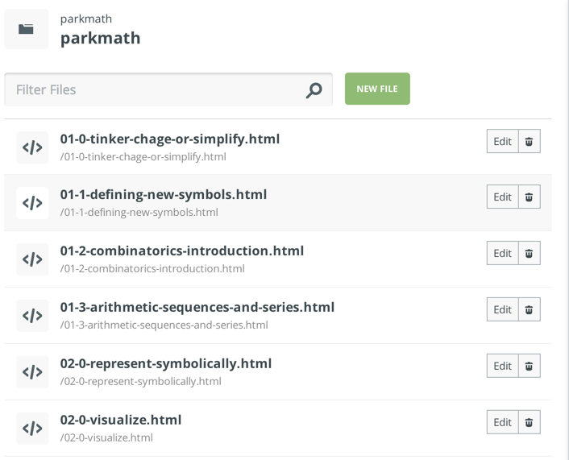
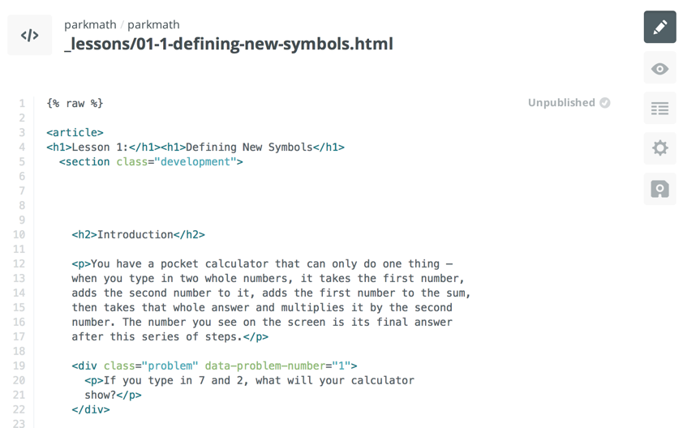

# Editing a Lesson

The entire content of the textbook, as well as the data assembling, formatting, and printing the books, is stored on Github, at http://github.com/parkmath/parkmath.  The lessons themselves are in the a folder called [_lessons](https://github.com/parkmath/parkmath/tree/gh-pages/_lessons).

## Prose
**Prose** is a web app that will let you edit the lesson HTML files on github directly.  The "official" one is at http://prose.io, but I'm running a modified version at http://prose.anandthakker.net. (The modified version has some extra features, like equation preview, and I'm hoping to add some more.)

When you first go to Prose, it'll ask you to authorize access your Github account:


Once that's done (and, warning, it might take a minute), you should be logged in.  You'll see something like this:


Over on the right under Groups, click on "parkmath", which should bring up a project--also called "parkmath"--in the center of the screen.  Click that.

Now, if you see this: 



Then you're good to go--edit away!  When you click a lesson to edit it, you'll be on a screen like the one below.  A few notes:
- The  and  at the beginning/end are annoying necessities--just leave 'em there.
- The eye-shaped icon on the right allows you to preview your changes, including rendering LateX into pretty equations.  The headers and footers of the page are buggy in preview mode, but it should still give you a sense of what your changes will look like before you save them.
- The "Published"/"Unpublished" button does basically what you'd expect: if a lesson is unpublished, it won't show up in the list on the live website.  Currently, most of the lessons unpublished because I'm in the process of going through and doing the final round of fixes on each lesson.  But feel free to publish them if you wanna see them live--easy enough to unpublish later.




## About HTML

- HTML documents have heirarchical structure.
- That structure is marked by **tags**, e.g., `<p>This is a paragraph</p>`.  In that example, `<p>` is the 'opening' tag, and `</p>` is the 'closing tag'.  Together the whole thing is called an **element**.
- Common elements:
  - `<p>...</p>`: a paragraph.
  - `<h1>...</h1>`, `<h2>...</h2>`, ... `<h6>...</h6>`: a heading or subheading
  - `<section>...</section>`: a meaningful section of the document.
  - `<div>...</div>`: a smaller chunk ('division') of the document.
  - `<a>...</a>`: a link.
  - `<figure>...</figure>`: a figure.
  - ``: an image; often goes inside a `figure`; note that `img` elements have
    **no closing tag**.
- Tags can be annotated with meta-information, like so: `` or `<div class="problem">...</section>`.
  In the first one, the required `src` attribute provides the location of an image file.  In
  the second one, the optional `class` attribute is a way to assign an author-defined
  category to an element.

Because they are used as part of HTML's syntax, three symbols--&lt;, &gt;, and &amp;--must
be written using the following special codes: `<`=`&lt;`, `>`=`&gt;`, `&`=`&amp;`.

## Lesson Files:

The HTML files for all of the lessons (including habits lessons) are located in the [_lessons](/parkmath/parkmath/tree/gh-pages/_lessons) directory.  Each one looks
like this:

```html
<article>
  <h1>Lesson 1: ...</h1>
  <section class="development">

    <h2>Introduction</h2>

    <p>... intro text ...</p>

    <div class="problem">
      <p>...problem text...</p>
    </div>
    
    <div class="problem">
      <p>...problem text...</p>
      <p class="problem-part">...part a text...</p>
      <p class="problem-part">...part b text...</p>
    </div>
    
    <h2>Development</h2>
    [... more text and problems ...]
    
    <h2>Practice</h2>
    [... more text and problems ...]
  </section>
  
  <section class="problems">
    <h2>Problems</h2>
    [... more text and problems ...]
    
    <h2>Exploring in Depth</h2>
    [... more text and problems ...]
  </section>
</article>
```

## Book Structure

```html
<html>
  <head>...</head>
  <body>
    <header class="site-header"></header>
    
    <section class="book book-2">

      <section class="info">..."how to use this book", copyright, etc...</section>
      <section class="title-page">...</section>
      <section class="toc">
        <h1>Table of Contents</h1>
        <ul class="lessons">
          <li><a href="#habits-of-mind">Mathematical Habits of Mind</a></li>
          <li><a href="#lesson-2-0-1">Habits of Mind: Visualize</a></li>
          <li><a href="#lesson-2-0-2">Habits of Mind: Represent Symbolically</a></li>
          <li><a href="#lesson-2-1">Lesson 1: Linear Equations</a></li>
          ... etc ...
        </ul>
      </section>
      <section class="habit-list" id="habits-of-mind">
        <div class="container">
          ... habit list with definitions of each habit ...
        </div>
      </section>
      <section class="lesson habit-lesson" id="lesson-2-0-1">
        <div class="container">
          <article>
          ... lesson content ...
          </article>
        </div>
      </section>
      
      <section class="lesson habit-lesson" id="lesson-2-0-2">
        <div class="container">
          <article>
          ... lesson content ...
          </article>
        </div>
      </section>
      
      <section class="lesson" id="lesson-2-1">
        <div class="container">
          <article>
          ... lesson content ...
          </article>
        </div>
      </section>
      
      ...
    </section>
    
    <footer class="site-footer"></footer>
  </body>

</html>
```

## Equations

Equations, written in Latex, can go anywhere that plain text can go, simply by
surrounding the Latex expression with dollar signs.  E.g., `<p>Find integers to
solve the equation $ x^3 + y^3 = z^3 $.</p>`.

Note that since dollar signs are used to indicate a Latex equation, if you want
to have an actual dollar sign in the text, it must be preceeded with a backslash,
like so: `<p>...select 21 coins which have a total value of exactly
\$1.00...</p>`.

## Markup

(TODO: fill this out)

- `data-problem-number` and `data-problem-part`
- `em.vocab`
- `fig-50`
